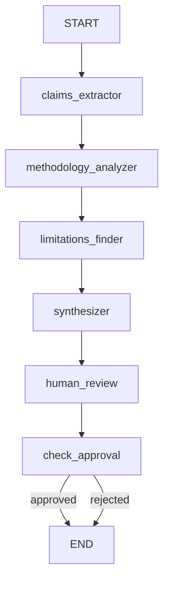

# LangGraph Multi-Agent Research Paper Analyzer

A sophisticated multi-agent system built with LangGraph that analyzes research papers through coordinated AI agents with human-in-the-loop approval, real-time streaming outputs, and interactive graph visualization.

## Project Overview

This project demonstrates LangGraph's powerful capabilities for building stateful, multi-agent workflows. Four specialized AI agents collaborate to analyze research papers, with a human reviewer providing final approval before saving the analysis. The system showcases:

- **Multi-agent coordination** with shared state management
- **Human-in-the-loop** workflow with interrupts and approval gates
- **Streaming outputs** for real-time feedback
- **Graph visualization** to understand workflow structure
- **State persistence** with checkpointers for resumable execution

## Architecture

### Workflow Graph

```
START → Claims Extractor → Methodology Analyzer → Limitations Finder 
      → Synthesizer → Human Review → [Approved? → END | Rejected? → END]
```

### Agent Roles

1. **Claims Extractor Agent** 
   - Identifies 3-5 key claims and hypotheses
   - Extracts main contributions of the paper

2. **Methodology Analyzer Agent** 
   - Analyzes research methods and approach
   - Evaluates data sources and experimental design

3. **Limitations Finder Agent** 
   - Identifies study limitations and weaknesses
   - Provides constructive critique

4. **Synthesizer Agent** 
   - Combines all analyses into coherent report
   - Creates executive summary with key insights

5. **Human Review Node** 
   - Pauses execution for human approval
   - Allows accept/reject decision

## Key LangGraph Concepts Demonstrated

### 1. State Management
- **TypedDict-based state schema** that flows through all nodes
- Immutable state updates with proper typing
- Context preservation across agent transitions

### 2. Graph-Based Execution
- **Nodes**: Individual agents as processing units
- **Edges**: Connections defining workflow flow
- **Conditional Edges**: Branching logic based on state

### 3. Human-in-the-Loop (HITL)
- **Interrupts**: Pause execution for human input
- **Checkpointing**: Save state and resume from exact point
- **State updates**: Modify state based on human decisions

### 4. Streaming
- Token-by-token output from LLM agents
- Real-time progress feedback
- Enhanced user experience

## Flow:



## Prerequisites

### Required Software
- Python 3.10 or higher
- Ollama installed and running

### Install Ollama
```bash
# macOS/Linux
curl -fsSL https://ollama.com/install.sh | sh

# Or download from https://ollama.com/download
```

### Pull Required Model
```bash
ollama pull llama3
```

Verify Ollama is running:
```bash
ollama list  # Should show llama3
```

## Installation

### 1. Clone/Create Project
```bash
mkdir langgraph-analyzer
cd langgraph-analyzer
```

### 2. Create Virtual Environment
```bash
python -m venv venv

# Activate virtual environment
# On macOS/Linux:
source venv/bin/activate
# On Windows:
venv\Scripts\activate
```

### 3. Install Dependencies
```bash
pip install -r requirements.txt
```

### 4. Set Up Project Structure
```bash
mkdir -p outputs
```

### 5. Add Sample PDF
Place a research paper PDF in `data/papers/` directory.

## Usage

### Basic Usage

```bash
python main.py data/papers/NIPS-2017-attention-is-all-you-need-Paper.pdf
```

### Example Session

```bash
python main.py data/papers/attention_is_all_you_need.pdf

=============================================================
WORKFLOW GRAPH (Mermaid Syntax)
=============================================================
graph TD
    START --> claims_extractor
    claims_extractor --> methodology_analyzer
    methodology_analyzer --> limitations_finder
    limitations_finder --> synthesizer
    synthesizer --> human_review
    human_review --> check_approval
    check_approval -->|approved| END
    check_approval -->|rejected| END
=============================================================

Copy the above to https://mermaid.live to visualize

Workflow Structure:
START → Claims Extractor → Methodology Analyzer
     → Limitations Finder → Synthesizer
     → Human Review → [Approve/Reject] → END

=== Analyzing Paper: "Attention Is All You Need" ===

[Step 1/4] Claims Extractor Agent 
Extracting key claims and hypotheses...

Key Claims Identified:
1. Self-attention mechanisms can completely replace recurrence and convolution
2. The Transformer architecture achieves superior performance on translation tasks
3. Multi-head attention allows the model to jointly attend to information
...

[Step 2/4] Methodology Analyzer Agent 
Analyzing research methodology...

Methodology Analysis:
Architecture Type: Encoder-decoder with stacked self-attention layers
Dataset: WMT 2014 English-German and English-French
Training Setup: 8 NVIDIA P100 GPUs for 12 hours
...

[Step 3/4] Limitations Finder Agent 
Identifying limitations and potential weaknesses...

Limitations Identified:
1. Computational Requirements: High GPU memory and processing needs
2. Task Scope: Primarily evaluated on machine translation
3. Interpretability: Attention weights don't always reflect reasoning
...

[Step 4/4] Synthesizer Agent 
Synthesizing comprehensive report...

=== SYNTHESIZED REPORT ===

Executive Summary:
This groundbreaking paper introduces the Transformer architecture,
demonstrating that self-attention mechanisms alone can achieve
state-of-the-art results in sequence-to-sequence tasks...

[Full report displayed]

==================================================

🔍 Human Review Required
Approve this report? (yes/no): yes

✅ Report approved and saved!
Report saved to: outputs/attention_is_all_you_need_analysis.txt
```

## Graph Visualization

The system generates Mermaid diagram syntax that you can visualize:

1. Copy the Mermaid syntax from console output
2. Visit [https://mermaid.live](https://mermaid.live)
3. Paste the syntax to see an interactive diagram

This helps you understand:
- Node connections and flow
- Conditional branching points
- Where human review occurs
- Overall workflow structure

## Human-in-the-Loop Workflow

### How It Works

1. **Execution Pauses**: After synthesis, the workflow stops at the human review node
2. **State Preserved**: Current state is checkpointed (saved to memory)
3. **Human Input**: User reviews the report and approves/rejects
4. **State Updated**: Decision is stored in state
5. **Execution Resumes**: Workflow continues from checkpoint to completion

### Implementation Details

```python
# The workflow uses LangGraph's interrupt mechanism
config = {"configurable": {"thread_id": "unique_id"}}

# Run until interrupt (human review node)
for event in graph.stream(initial_state, config):
    # Process agent outputs
    pass

# At this point, execution is paused
# Get human approval
approval = input("Approve? (yes/no): ")

# Update state with decision
graph.update_state(config, {"human_approved": approval == "yes"})

# Continue from checkpoint
for event in graph.stream(None, config):
    # Complete workflow
    pass
```

### Why Use HITL?

- **Quality Control**: Ensure AI outputs meet standards
- **Oversight**: Human judgment on critical decisions
- **Flexibility**: Can extend to include revision loops
- **Learning**: Understand when AI needs human guidance

## Streaming Feature

### Real-Time Output

Each agent streams its response token-by-token:

```python
# Agent implementation with streaming
llm = ChatOllama(model="llama3", streaming=True)

chunks = []
for chunk in llm.stream(prompt):
    print(chunk.content, end="", flush=True)  # Real-time display
    chunks.append(chunk.content)
```

### Benefits

- **Immediate Feedback**: See progress as it happens
- **Better UX**: No waiting for complete responses
- **Debugging**: Identify where agents get stuck
- **Engagement**: Keeps users informed

## Extending the Project

### Add Revision Loops

Modify conditional routing to allow revisions:

```python
def check_approval(state: State) -> str:
    if state.get("human_approved"):
        return "approved"
    elif state.get("needs_revision"):
        return "revise"
    else:
        return "rejected"

builder.add_conditional_edges(
    "human_review",
    check_approval,
    {
        "approved": END,
        "revise": "synthesizer",  # Loop back for revisions
        "rejected": END
    }
)
```

### Add More Agents

Create specialized agents:
- **Citation Checker**: Verify references
- **Statistics Validator**: Check statistical claims
- **Novelty Assessor**: Compare with prior work
- **Clarity Reviewer**: Assess writing quality

### Multi-Paper Comparison

Extend state to handle multiple papers:
```python
class ComparativeState(TypedDict):
    papers: List[Dict[str, Any]]
    comparative_analysis: str
    similarities: List[str]
    differences: List[str]
```

### Export to Different Formats

Add export nodes:
- JSON structured output
- Markdown formatted report
- LaTeX academic summary
- PowerPoint slide deck

## Project Structure

```
langgraph-analyzer/
├── README.md                 # This file
├── requirements.txt          # Python dependencies
├── .env.example             # Environment variables template
├── data/
│   └── papers/              # Input PDF papers
├── outputs/                 # Generated analysis reports
├── src/
│   ├── __init__.py
│   ├── agents/
│   │   ├── __init__.py
│   │   ├── claims_extractor.py      # Agent 1
│   │   ├── methodology_analyzer.py  # Agent 2
│   │   ├── limitations_finder.py    # Agent 3
│   │   └── synthesizer.py           # Agent 4
│   ├── graph_builder.py     # LangGraph workflow construction
│   ├── state.py            # State schema definition
│   ├── visualization.py     # Graph visualization utilities
│   └── utils.py            # Helper functions
├── examples/
│   └── sample_analysis.py   # Example usage
└── main.py                 # CLI interface
```

## Testing

### Test Individual Agents

```python
from src.agents.claims_extractor import claims_extractor_agent
from src.state import State

test_state = State(
    paper_text="Sample paper text...",
    paper_title="Test Paper"
)

result = claims_extractor_agent(test_state)
print(result["claims"])
```

### Test Graph Execution

```python
from src.graph_builder import build_graph

graph = build_graph()
initial_state = {...}

# Test without human interaction
for event in graph.stream(initial_state):
    print(event)
```

## Troubleshooting

### Ollama Connection Issues

```bash
# Check if Ollama is running
curl http://localhost:11434/api/tags

# Restart Ollama service
# macOS/Linux:
pkill ollama && ollama serve

# Windows: Restart Ollama application
```

### Memory Issues with Large PDFs

Adjust chunk size in `utils.py`:
```python
# For large papers, extract first N pages only
MAX_PAGES = 10
```

### Streaming Not Working

Ensure `streaming=True` in ChatOllama initialization:
```python
llm = ChatOllama(model="llama3", streaming=True, temperature=0.7)
```

## 📖 Learning Resources

### LangGraph Documentation
- [Official LangGraph Docs](https://docs.langchain.com/oss/python/langgraph/overview)

### Key Concepts
- [State Management](https://docs.langchain.com/oss/python/langchain/overview#state)
- [Checkpointing](https://docs.langchain.com/oss/javascript/langgraph/persistence#persistence)
- [Streaming](https://docs.langchain.com/oss/javascript/langgraph/streaming#streaming)
- [Conditional Edges](https://docs.langchain.com/oss/python/langchain/streaming/frontend#branching)

### Related Projects
- [LangChain Documentation](https://docs.langchain.com/oss/python/langchain/overview)
- [Ollama Documentation](https://github.com/ollama/ollama)

## Contributing

Ideas for contributions:
1. Add more specialized agents
2. Implement revision feedback loops
3. Create web UI with Streamlit/Gradio
4. Add support for multiple LLM providers
5. Implement batch processing for multiple papers
6. Add citation extraction and verification
7. Create comparative analysis mode

## License

MIT License - Feel free to use and modify for your projects.

## Acknowledgments

- Built with [LangGraph](https://github.com/langchain-ai/langgraph)
- Powered by [Ollama](https://ollama.com/) and Llama 3

---

**Happy Learning!**

For questions or issues, please refer to the LangGraph documentation or create an issue in the project repository.